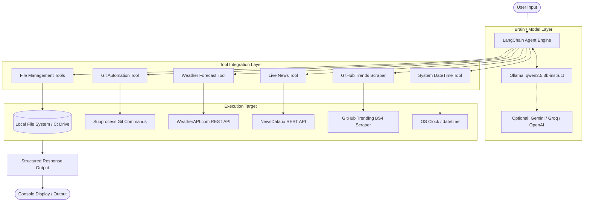

# 🤖 My_Agent — Local Multi-Tool AI Assistant

[](https://www.python.org/)
[](https://www.langchain.com/)
[](https://ollama.com/)
[](LICENSE)

**My_Agent** is an intelligent, extensible, local-first autonomous agent powered by **LangChain** and local LLMs (via **Ollama**). It integrates multi-domain capabilities — from local file system management and Git version control to real-time weather forecasting, live news curation, and GitHub trend scraping.

---

## 📑 Table of Contents

- [Overview](#-overview)
- [Architecture](#-architecture)
- [Key Features](#-key-features)
- [Project Structure](#-project-structure)
- [Tools Directory & Capabilities](#-tools-directory--capabilities)
- [Prerequisites](#-prerequisites)
- [Installation & Setup](#-installation--setup)
- [Environment Configuration](#-environment-configuration)
- [Usage Guide](#-usage-guide)
  - [Running the Main Agent](#1-running-the-main-agent)
  - [Running Specialized Standalone Agents](#2-running-specialized-standalone-agents)
- [LLM Provider Customization](#-llm-provider-customization)
- [Troubleshooting](#-troubleshooting)
- [Roadmap & Contributing](#-roadmap--contributing)

---

## 🌟 Overview

`My_Agent` acts as a conversational operating system assistant on your local machine. Built on top of `langchain.agents.create_agent` and defaulting to `qwen2.5:3b-instruct` via Ollama, it can interpret user instructions, reason step-by-step, invoke appropriate native or API tools, and return structured, formatted results.

```
       +--------------------------------------------------------+
       |                     User Prompt                        |
       +---------------------------+----------------------------+
                                   |
                                   v
             +-------------------------------------------+
             |   LangChain Agent (Qwen 2.5 3B / Ollama)  |
             +---------------------+---------------------+
                                   |
       +---------------+-----------+-----------+----------------+
       |               |                       |                |
       v               v                       v                v
+--------------+ +------------+        +---------------+ +-------------+
| File System  | | Git Tools  |        | Weather & Time| | Web Data    |
| (Search/CRUD)| | (CLI Exec) |        | (API / System)| | (News/Repos)|
+--------------+ +------------+        +---------------+ +-------------+
```

---

## 🏛 Architecture



---

## ✨ Key Features

- **🏠 100% Local LLM Inference**: Runs locally by default using `qwen2.5:3b-instruct` via Ollama — zero cloud token costs and full privacy.
- **📁 Advanced File System Automation**:
  - Deep-walk search for files and folders across drive directories.
  - Safe file creation and file deletion with existence checks to prevent unintentional overwrites.
- **🔧 Git Command Automation**:
  - Execute `git status`, `git add`, `git commit`, `git push`, and `git remote` directly through natural language.
- **🌤 Live Weather Ingestion**: Real-time temperature, condition, and location reporting via WeatherAPI.
- **📰 Curated News Summarizer**: Fetch and summarize live headlines, publications, and dates with NewsData.io.
- **🚀 GitHub Trending Explorer**: Real-time web scraper discovering trending open-source repositories, languages, and star counts.
- **🔄 Multi-Question Reasoning**: Built-in system prompt guidelines to handle compound multi-step queries without ignoring sub-tasks.

---

## 📂 Project Structure

```text
My_Agent/
├── tools/                      # Modular tool definitions & agents
│   ├── __init__.py             # Python package initializer
│   ├── file_management.py      # File search, folder search, create, delete tools
│   ├── get_news.py             # NewsData API client & standalone news agent
│   ├── get_repos.py            # GitHub Trending scraper using BeautifulSoup
│   ├── get_weather.py          # WeatherAPI current weather fetcher
│   ├── git_tool.py             # Git operations tool & standalone Git agent
│   └── my_datetime.py          # System date & timestamp provider
├── .env                        # Environment variables & API keys (ignored by git)
├── .env.example                # Example environment configuration template
├── .gitignore                  # Git ignore rules
├── .python-version             # Python version pin (3.12)
├── main.py                     # Primary agent CLI entrypoint
├── pyproject.toml              # Project configuration and uv dependencies
├── requirements.txt            # Pip-compatible requirements file
└── uv.lock                     # UV dependency lockfile
```

---

## 🛠 Tools Directory & Capabilities

| Tool Name | Function / Method | Parameters | Description |
| :--- | :--- | :--- | :--- |
| **File Search** | `get_files` | `filename: str` | Scans directories to return the absolute path of a file. |
| **Folder Search** | `get_folder` | `folder_name: str` | Locates the directory path by folder name. |
| **Directory Search** | `get_directory` | `folder: str, file: str` | Locates a specific file inside a specified directory. |
| **Create File** | `create_file` | `filename: str, content: str` | Safely creates a file and writes UTF-8 content. |
| **Delete File** | `delete_file` | `file: str` | Validates existence and removes the specified file. |
| **Git Operations** | `git_operations` | `operation: str, filename: str, message: str` | Runs `status`, `add`, `commit`, `push`, or `remote` commands. |
| **Weather** | `get_weather` | `city: str` | Fetches real-time temperature, condition, and location data. |
| **News** | `get_news` | `query: str` | Queries latest news articles with headline, source, and date. |
| **GitHub Trends** | `get_repos` | `query: str` | Scrapes trending repos, stars, and primary languages. |
| **Date & Time** | `get_datetime` | `query: str` | Returns current system date and timestamp. |

---

## ⚡ Prerequisites

1. **Python 3.12+**: Ensure Python is installed on your system.
2. **Ollama**: Download and install Ollama from [ollama.com](https://ollama.com/).
3. **Pull the Default Model**:
   ```bash
   ollama pull qwen2.5:3b-instruct
   ```
4. **Git**: Required if utilizing the Git automation tools.

---

## 📥 Installation & Setup

### Option 1: Using `uv` (Recommended)

```bash
# Clone or navigate to the repository
cd My_Agent

# Create and sync virtual environment
uv sync
```

### Option 2: Using standard `pip` & `venv`

```bash
# Create a virtual environment
python -m venv .venv

# Activate virtual environment
# Windows (PowerShell):
.venv\Scripts\Activate.ps1
# Windows (CMD):
.venv\Scripts\activate.bat
# Linux / macOS:
source .venv/bin/activate

# Install dependencies
pip install -r requirements.txt
```

---

## 🔑 Environment Configuration

Create a `.env` file in the root directory (or copy from `.env.example`):

```bash
# Windows
copy .env.example .env

# Linux / macOS
cp .env.example .env
```

Populate the required API keys inside `.env`:

```ini
# Weather Tool (Get free key at https://www.weatherapi.com/)
WEATHER_API_KEY=your_weather_api_key_here

# News Tool (Get free key at https://newsdata.io/)
NEWS_API_KEY=your_newsdata_api_key_here

# Optional: Cloud LLM providers if switching from local Ollama
GROQ_API_KEY=your_groq_key_here
GEMINI_API_KEY=your_gemini_key_here
OPENAI_API_KEY=your_openai_key_here
OPENROUTER_API_KEY=your_openrouter_key_here
```

---

## 🚀 Usage Guide

### 1. Running the Main Agent

The primary entry point integrates weather, datetime, and full file system operations.

```bash
python main.py
```

#### Example Interactions

```text
Enter the prompt: What is the current date and time, and what is the weather in Tokyo?
```
**Output:**
```text
Date: 2026-09-01
Time: 22:45:00

Temperature: 24.5°C
City: Tokyo
Condition: Clear
```

```text
Enter the prompt: Create a file named notes.txt with content "Meeting at 10 AM"
```
**Output:**
```text
notes.txt file has created successfully
```

---

### 2. Running Specialized Standalone Agents

Individual tool modules can also be run independently as dedicated agents:

#### 🤖 Git Automation Agent
```bash
python tools/git_tool.py
```
> *Prompts you to check status, stage files, write commit messages, and push changes.*

#### 📰 AI News Agent
```bash
python tools/get_news.py
```
> *Fetches and summarizes top 10 trending AI news headlines with dates and sources.*

---

## 🔄 LLM Provider Customization

The project is built on LangChain's modular architecture, making it easy to swap models. In `main.py` or tool files, you can switch between local and cloud providers:

```python
# 1. Local Ollama (Default)
from langchain_ollama import ChatOllama
llm = ChatOllama(model="qwen2.5:3b-instruct")

# 2. Groq (High-speed inference)
# from langchain_groq import ChatGroq
# llm = ChatGroq(model_name="llama-3.3-70b-versatile")

# 3. Google Gemini
# from langchain_gemini import ChatGemini
# llm = ChatGemini(model="gemini-1.5-flash")

# 4. OpenAI
# from langchain_openai import ChatOpenAI
# llm = ChatOpenAI(model="gpt-4o-mini")
```

---

## ❓ Troubleshooting

<details>
<summary><b>1. Ollama connection refused / model not found</b></summary>

- Ensure Ollama service is running: `ollama serve`
- Confirm model is pulled: `ollama list`
- If not present, download it: `ollama pull qwen2.5:3b-instruct`
</details>

<details>
<summary><b>2. "the api is not connected" or Weather API fails</b></summary>

- Verify your `.env` file exists in the root directory.
- Confirm `WEATHER_API_KEY` or `NEWS_API_KEY` are valid and have active quota.
</details>

<details>
<summary><b>3. File search is slow on Windows</b></summary>

- `os.walk("C:\\")` searches the entire C: drive. For faster targeted searches, specify project folders or restrict root search directories in `tools/file_management.py`.
</details>

---

## 🗺 Roadmap & Contributing

- [ ] Add interactive continuous chat loop (REPL mode).
- [ ] Implement memory & chat history persistence across sessions.
- [ ] Add PDF reading & Markdown conversion tools (using `pymupdf` & `markitdown`).
- [ ] Web UI interface using Streamlit or Gradio.

Contributions are welcome! Feel free to open issues or submit pull requests.

---

## 📄 License

This project is licensed under the MIT License. See [LICENSE](LICENSE) for details.
